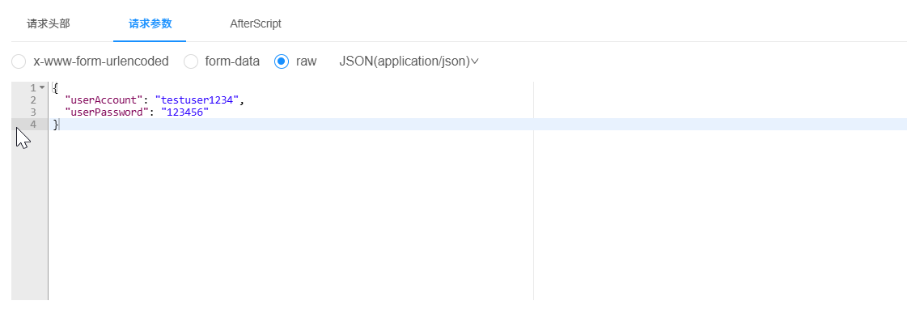

# user/register

当我对接口/user/register进行测试输入以下结果:

```json
{
  "userAccount": "testuser123",
  "userPassword": "password123",
  "checkPassword": "password123",
  "username": "张三",
  "email": "zhangsan@example.com",
  "phone": "13812345678",
  "planetCode": "EARTH001",
  "gender": 1
}
```

knife4j出现问题：

{
  "code": 50000,
  "data": "系统内部异常",
  "message": "\r\n### Error querying database.  Cause: java.sql.SQLSyntaxErrorException: Unknown column 'is_delete' in 'where clause'\r\n### The error may exist in com/example/usercenter/mapper/UserMapper.java (best guess)\r\n### The error may involve defaultParameterMap\r\n### The error occurred while setting parameters\r\n### SQL: SELECT COUNT( * ) AS total FROM user   WHERE  is_delete=0  AND (planetCode = ?)\r\n### Cause: java.sql.SQLSyntaxErrorException: Unknown column 'is_delete' in 'where clause'\n; bad SQL grammar []; nested exception is java.sql.SQLSyntaxErrorException: Unknown column 'is_delete' in 'where clause'",
  "description": ""
}

## java后端返回问题：

Creating a new SqlSession
SqlSession [org.apache.ibatis.session.defaults.DefaultSqlSession@229ef3f7] was not registered for synchronization because synchronization is not active
JDBC Connection [HikariProxyConnection@744036820 wrapping com.mysql.cj.jdbc.ConnectionImpl@5cb700bf] will not be managed by Spring
==>  Preparing: SELECT COUNT( * ) AS total FROM user WHERE is_delete=0 AND (planetCode = ?)
==> Parameters: EARTH001(String)
Closing non transactional SqlSession [org.apache.ibatis.session.defaults.DefaultSqlSession@229ef3f7]
2025-11-13 12:44:09.591 ERROR 13472 --- [nio-8081-exec-2] c.e.u.exception.GlobalExceptionHandler   : RuntimeException:

org.springframework.jdbc.BadSqlGrammarException:

### Error querying database.  Cause: java.sql.SQLSyntaxErrorException: Unknown column 'is_delete' in 'where clause'

### The error may exist in com/example/usercenter/mapper/UserMapper.java (best guess)

### The error may involve defaultParameterMap

### The error occurred while setting parameters

### SQL: SELECT COUNT( * ) AS total FROM user   WHERE  is_delete=0  AND (planetCode = ?)

### Cause: java.sql.SQLSyntaxErrorException: Unknown column 'is_delete' in 'where clause'

; bad SQL grammar []; nested exception is java.sql.SQLSyntaxErrorException: Unknown column 'is_delete' in 'where clause'
	at org.springframework.jdbc.support.SQLErrorCodeSQLExceptionTranslator.doTranslate(SQLErrorCodeSQLExceptionTranslator.java:236) ~[spring-jdbc-5.3.30.jar:5.3.30]
	at org.springframework.jdbc.support.AbstractFallbackSQLExceptionTranslator.translate(AbstractFallbackSQLExceptionTranslator.java:73) ~[spring-jdbc-5.3.30.jar:5.3.30]
	at org.mybatis.spring.MyBatisExceptionTranslator.translateExceptionIfPossible(MyBatisExceptionTranslator.java:91) ~[mybatis-spring-2.0.7.jar:2.0.7]
	at org.mybatis.spring.SqlSessionTemplate$SqlSessionInterceptor.invoke(SqlSessionTemplate.java:441) ~[mybatis-spring-2.0.7.jar:2.0.7]
	at com.sun.proxy.$Proxy81.selectOne(Unknown Source) ~[na:na]
	at org.mybatis.spring.SqlSessionTemplate.selectOne(SqlSessionTemplate.java:160) ~[mybatis-spring-2.0.7.jar:2.0.7]
	at com.baomidou.mybatisplus.core.override.MybatisMapperMethod.execute(MybatisMapperMethod.java:89) ~[mybatis-plus-core-3.5.3.1.jar:3.5.3.1]
	at com.baomidou.mybatisplus.core.override.MybatisMapperProxy$PlainMethodInvoker.invoke(MybatisMapperProxy.java:148) ~[mybatis-plus-core-3.5.3.1.jar:3.5.3.1]
	at com.baomidou.mybatisplus.core.override.MybatisMapperProxy.invoke(MybatisMapperProxy.java:89) ~[mybatis-plus-core-3.5.3.1.jar:3.5.3.1]
	at com.sun.proxy.$Proxy85.selectCount(Unknown Source) ~[na:na]
	at com.example.tagmate.service.impl.UserServiceImpl.userRegister(UserServiceImpl.java:93) ~[classes/:na]
	at com.example.tagmate.service.impl.UserServiceImpl

$$
FastClassBySpringCGLIB
$$

1a52fbb2.invoke(

`<generated>`

) ~[classes/:na]
	at org.springframework.cglib.proxy.MethodProxy.invoke(MethodProxy.java:218) ~[spring-core-5.3.30.jar:5.3.30]
	at org.springframework.aop.framework.CglibAopProxy.invokeMethod(CglibAopProxy.java:386) ~[spring-aop-5.3.30.jar:5.3.30]
	at org.springframework.aop.framework.CglibAopProxy.access$000(CglibAopProxy.java:85) ~[spring-aop-5.3.30.jar:5.3.30]
	at org.springframework.aop.framework.CglibAopProxy$DynamicAdvisedInterceptor.intercept(CglibAopProxy.java:703) ~[spring-aop-5.3.30.jar:5.3.30]
	at com.example.tagmate.service.impl.UserServiceImpl

$$
EnhancerBySpringCGLIB
$$

f8dd4a4c.userRegister(

`<generated>`

) ~[classes/:na]
	at com.example.tagmate.controller.UserController.userRegister(UserController.java:76) ~[classes/:na]
	at sun.reflect.NativeMethodAccessorImpl.invoke0(Native Method) ~[na:1.8.0_452]
	at sun.reflect.NativeMethodAccessorImpl.invoke(NativeMethodAccessorImpl.java:62) ~[na:1.8.0_452]
	at sun.reflect.DelegatingMethodAccessorImpl.invoke(DelegatingMethodAccessorImpl.java:43) ~[na:1.8.0_452]
	at java.lang.reflect.Method.invoke(Method.java:498) ~[na:1.8.0_452]
	at org.springframework.web.method.support.InvocableHandlerMethod.doInvoke(InvocableHandlerMethod.java:205) ~[spring-web-5.3.30.jar:5.3.30]
	at org.springframework.web.method.support.InvocableHandlerMethod.invokeForRequest(InvocableHandlerMethod.java:150) ~[spring-web-5.3.30.jar:5.3.30]
	at org.springframework.web.servlet.mvc.method.annotation.ServletInvocableHandlerMethod.invokeAndHandle(ServletInvocableHandlerMethod.java:117) ~[spring-webmvc-5.3.30.jar:5.3.30]
	at org.springframework.web.servlet.mvc.method.annotation.RequestMappingHandlerAdapter.invokeHandlerMethod(RequestMappingHandlerAdapter.java:895) ~[spring-webmvc-5.3.30.jar:5.3.30]
	at org.springframework.web.servlet.mvc.method.annotation.RequestMappingHandlerAdapter.handleInternal(RequestMappingHandlerAdapter.java:808) ~[spring-webmvc-5.3.30.jar:5.3.30]
	at org.springframework.web.servlet.mvc.method.AbstractHandlerMethodAdapter.handle(AbstractHandlerMethodAdapter.java:87) ~[spring-webmvc-5.3.30.jar:5.3.30]
	at org.springframework.web.servlet.DispatcherServlet.doDispatch(DispatcherServlet.java:1072) ~[spring-webmvc-5.3.30.jar:5.3.30]
	at org.springframework.web.servlet.DispatcherServlet.doService(DispatcherServlet.java:965) ~[spring-webmvc-5.3.30.jar:5.3.30]
	at org.springframework.web.servlet.FrameworkServlet.processRequest(FrameworkServlet.java:1006) [spring-webmvc-5.3.30.jar:5.3.30]
	at org.springframework.web.servlet.FrameworkServlet.doPost(FrameworkServlet.java:909) [spring-webmvc-5.3.30.jar:5.3.30]
	at javax.servlet.http.HttpServlet.service(HttpServlet.java:555) [tomcat-embed-core-9.0.82.jar:4.0.FR]
	at org.springframework.web.servlet.FrameworkServlet.service(FrameworkServlet.java:883) [spring-webmvc-5.3.30.jar:5.3.30]
	at javax.servlet.http.HttpServlet.service(HttpServlet.java:623) [tomcat-embed-core-9.0.82.jar:4.0.FR]
	at org.apache.catalina.core.ApplicationFilterChain.internalDoFilter(ApplicationFilterChain.java:209) [tomcat-embed-core-9.0.82.jar:9.0.82]
	at org.apache.catalina.core.ApplicationFilterChain.doFilter(ApplicationFilterChain.java:153) [tomcat-embed-core-9.0.82.jar:9.0.82]
	at org.apache.tomcat.websocket.server.WsFilter.doFilter(WsFilter.java:51) [tomcat-embed-websocket-9.0.82.jar:9.0.82]
	at org.apache.catalina.core.ApplicationFilterChain.internalDoFilter(ApplicationFilterChain.java:178) [tomcat-embed-core-9.0.82.jar:9.0.82]
	at org.apache.catalina.core.ApplicationFilterChain.doFilter(ApplicationFilterChain.java:153) [tomcat-embed-core-9.0.82.jar:9.0.82]
	at org.springframework.web.filter.RequestContextFilter.doFilterInternal(RequestContextFilter.java:100) [spring-web-5.3.30.jar:5.3.30]
	at org.springframework.web.filter.OncePerRequestFilter.doFilter(OncePerRequestFilter.java:117) [spring-web-5.3.30.jar:5.3.30]
	at org.apache.catalina.core.ApplicationFilterChain.internalDoFilter(ApplicationFilterChain.java:178) [tomcat-embed-core-9.0.82.jar:9.0.82]
	at org.apache.catalina.core.ApplicationFilterChain.doFilter(ApplicationFilterChain.java:153) [tomcat-embed-core-9.0.82.jar:9.0.82]
	at org.springframework.web.filter.FormContentFilter.doFilterInternal(FormContentFilter.java:93) [spring-web-5.3.30.jar:5.3.30]
	at org.springframework.web.filter.OncePerRequestFilter.doFilter(OncePerRequestFilter.java:117) [spring-web-5.3.30.jar:5.3.30]
	at org.apache.catalina.core.ApplicationFilterChain.internalDoFilter(ApplicationFilterChain.java:178) [tomcat-embed-core-9.0.82.jar:9.0.82]
	at org.apache.catalina.core.ApplicationFilterChain.doFilter(ApplicationFilterChain.java:153) [tomcat-embed-core-9.0.82.jar:9.0.82]
	at org.springframework.web.filter.CharacterEncodingFilter.doFilterInternal(CharacterEncodingFilter.java:201) [spring-web-5.3.30.jar:5.3.30]
	at org.springframework.web.filter.OncePerRequestFilter.doFilter(OncePerRequestFilter.java:117) [spring-web-5.3.30.jar:5.3.30]
	at org.apache.catalina.core.ApplicationFilterChain.internalDoFilter(ApplicationFilterChain.java:178) [tomcat-embed-core-9.0.82.jar:9.0.82]
	at org.apache.catalina.core.ApplicationFilterChain.doFilter(ApplicationFilterChain.java:153) [tomcat-embed-core-9.0.82.jar:9.0.82]
	at org.apache.catalina.core.StandardWrapperValve.invoke(StandardWrapperValve.java:168) [tomcat-embed-core-9.0.82.jar:9.0.82]
	at org.apache.catalina.core.StandardContextValve.invoke(StandardContextValve.java:90) [tomcat-embed-core-9.0.82.jar:9.0.82]
	at org.apache.catalina.authenticator.AuthenticatorBase.invoke(AuthenticatorBase.java:481) [tomcat-embed-core-9.0.82.jar:9.0.82]
	at org.apache.catalina.core.StandardHostValve.invoke(StandardHostValve.java:130) [tomcat-embed-core-9.0.82.jar:9.0.82]
	at org.apache.catalina.valves.ErrorReportValve.invoke(ErrorReportValve.java:93) [tomcat-embed-core-9.0.82.jar:9.0.82]
	at org.apache.catalina.core.StandardEngineValve.invoke(StandardEngineValve.java:74) [tomcat-embed-core-9.0.82.jar:9.0.82]
	at org.apache.catalina.connector.CoyoteAdapter.service(CoyoteAdapter.java:342) [tomcat-embed-core-9.0.82.jar:9.0.82]
	at org.apache.coyote.http11.Http11Processor.service(Http11Processor.java:390) [tomcat-embed-core-9.0.82.jar:9.0.82]
	at org.apache.coyote.AbstractProcessorLight.process(AbstractProcessorLight.java:63) [tomcat-embed-core-9.0.82.jar:9.0.82]
	at org.apache.coyote.AbstractProtocol$ConnectionHandler.process(AbstractProtocol.java:928) [tomcat-embed-core-9.0.82.jar:9.0.82]
	at org.apache.tomcat.util.net.NioEndpoint$SocketProcessor.doRun(NioEndpoint.java:1794) [tomcat-embed-core-9.0.82.jar:9.0.82]
	at org.apache.tomcat.util.net.SocketProcessorBase.run(SocketProcessorBase.java:52) [tomcat-embed-core-9.0.82.jar:9.0.82]
	at org.apache.tomcat.util.threads.ThreadPoolExecutor.runWorker(ThreadPoolExecutor.java:1191) [tomcat-embed-core-9.0.82.jar:9.0.82]
	at org.apache.tomcat.util.threads.ThreadPoolExecutor$Worker.run(ThreadPoolExecutor.java:659) [tomcat-embed-core-9.0.82.jar:9.0.82]
	at org.apache.tomcat.util.threads.TaskThread$WrappingRunnable.run(TaskThread.java:61) [tomcat-embed-core-9.0.82.jar:9.0.82]
	at java.lang.Thread.run(Thread.java:750) [na:1.8.0_452]
Caused by: java.sql.SQLSyntaxErrorException: Unknown column 'is_delete' in 'where clause'
	at com.mysql.cj.jdbc.exceptions.SQLError.createSQLException(SQLError.java:121) ~[mysql-connector-j-8.0.33.jar:8.0.33]
	at com.mysql.cj.jdbc.exceptions.SQLExceptionsMapping.translateException(SQLExceptionsMapping.java:122) ~[mysql-connector-j-8.0.33.jar:8.0.33]
	at com.mysql.cj.jdbc.ClientPreparedStatement.executeInternal(ClientPreparedStatement.java:916) ~[mysql-connector-j-8.0.33.jar:8.0.33]
	at com.mysql.cj.jdbc.ClientPreparedStatement.execute(ClientPreparedStatement.java:354) ~[mysql-connector-j-8.0.33.jar:8.0.33]
	at com.zaxxer.hikari.pool.ProxyPreparedStatement.execute(ProxyPreparedStatement.java:44) ~[HikariCP-4.0.3.jar:na]
	at com.zaxxer.hikari.pool.HikariProxyPreparedStatement.execute(HikariProxyPreparedStatement.java) ~[HikariCP-4.0.3.jar:na]
	at sun.reflect.NativeMethodAccessorImpl.invoke0(Native Method) ~[na:1.8.0_452]
	at sun.reflect.NativeMethodAccessorImpl.invoke(NativeMethodAccessorImpl.java:62) ~[na:1.8.0_452]
	at sun.reflect.DelegatingMethodAccessorImpl.invoke(DelegatingMethodAccessorImpl.java:43) ~[na:1.8.0_452]
	at java.lang.reflect.Method.invoke(Method.java:498) ~[na:1.8.0_452]
	at org.apache.ibatis.logging.jdbc.PreparedStatementLogger.invoke(PreparedStatementLogger.java:59) ~[mybatis-3.5.10.jar:3.5.10]
	at com.sun.proxy.$Proxy117.execute(Unknown Source) ~[na:na]
	at org.apache.ibatis.executor.statement.PreparedStatementHandler.query(PreparedStatementHandler.java:64) ~[mybatis-3.5.10.jar:3.5.10]
	at org.apache.ibatis.executor.statement.RoutingStatementHandler.query(RoutingStatementHandler.java:79) ~[mybatis-3.5.10.jar:3.5.10]
	at org.apache.ibatis.executor.SimpleExecutor.doQuery(SimpleExecutor.java:63) ~[mybatis-3.5.10.jar:3.5.10]
	at org.apache.ibatis.executor.BaseExecutor.queryFromDatabase(BaseExecutor.java:325) ~[mybatis-3.5.10.jar:3.5.10]
	at org.apache.ibatis.executor.BaseExecutor.query(BaseExecutor.java:156) ~[mybatis-3.5.10.jar:3.5.10]
	at org.apache.ibatis.executor.CachingExecutor.query(CachingExecutor.java:109) ~[mybatis-3.5.10.jar:3.5.10]
	at org.apache.ibatis.executor.CachingExecutor.query(CachingExecutor.java:89) ~[mybatis-3.5.10.jar:3.5.10]
	at org.apache.ibatis.session.defaults.DefaultSqlSession.selectList(DefaultSqlSession.java:151) ~[mybatis-3.5.10.jar:3.5.10]
	at org.apache.ibatis.session.defaults.DefaultSqlSession.selectList(DefaultSqlSession.java:145) ~[mybatis-3.5.10.jar:3.5.10]
	at org.apache.ibatis.session.defaults.DefaultSqlSession.selectList(DefaultSqlSession.java:140) ~[mybatis-3.5.10.jar:3.5.10]
	at org.apache.ibatis.session.defaults.DefaultSqlSession.selectOne(DefaultSqlSession.java:76) ~[mybatis-3.5.10.jar:3.5.10]
	at sun.reflect.NativeMethodAccessorImpl.invoke0(Native Method) ~[na:1.8.0_452]
	at sun.reflect.NativeMethodAccessorImpl.invoke(NativeMethodAccessorImpl.java:62) ~[na:1.8.0_452]
	at sun.reflect.DelegatingMethodAccessorImpl.invoke(DelegatingMethodAccessorImpl.java:43) ~[na:1.8.0_452]
	at java.lang.reflect.Method.invoke(Method.java:498) ~[na:1.8.0_452]
	at org.mybatis.spring.SqlSessionTemplate$SqlSessionInterceptor.invoke(SqlSessionTemplate.java:427) ~[mybatis-spring-2.0.7.jar:2.0.7]
	... 64 common frames omitted

## 以上问题已解决

## 接口问题：

1. 获取当前用户/user/current,delete,search,进行调试时无法i输入参数，且总是显示用户未登录

当我进行delete和查找操作时候，我希望根据Id查找。





